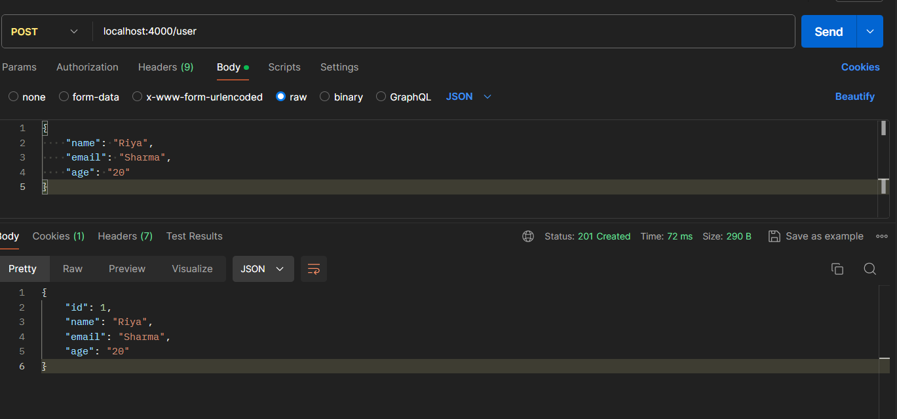
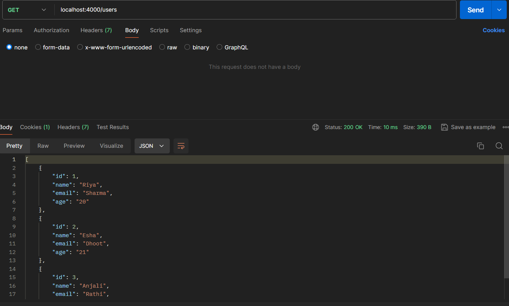

## CSI_4th_Assignment(NodeJs)
### "A basic web server with Express.js." 

- This is a simple Express.js application that provides basic user management functionalities. The API allows you to create a new user and fetch all users.

- Installation
    - Clone the repository or download the source code.
    - Navigate to the project directory.
    - Run the following command to install the required dependencies: `npm install`

- Starting the Server
    - To start the server, run the following command: `node index.js`
    - The server will start running on `PORT 4000`

- API Endpoints
    - Create a New User
        - URL: `/user`
        - Method: `POST`
        - Request Body: 
                    `{
                        "name": "your_name",
                        "email": "your_email",
                        "age": your_age
                    }`
    
       - Response
           - Status: `201 Created`
           - Body:
              `{
              "id": 1,
              "name": "your_name",
              "email": "your_email",
              "age": your_age
              }`

    - Fetch All Users
        - URL: `/users`
        - Method: `GET`
        - Response: 
            - Status: `200 OK`
            - Body: all users will be listed

- Middleware
    - checkRequiredFields
        This middleware checks if the required fields (`name`, `email`, `age`) are present in the request body. If any  of these fields are missing, it responds with a `400 Bad Request` status and an error message.

- Express Setup
    - Import the required modules and initialize the Express application.
    - Use `express.json()` and `express.urlencoded()` to parse incoming requests with JSON payloads and URL-encoded data.
    - Define the `checkRequiredFields` middleware to validate the request body.
    - Define the `/user` POST endpoint to create a new user.
    - Define the `/users` GET endpoint to fetch all users.
    - Start the server on the specified `PORT`.

